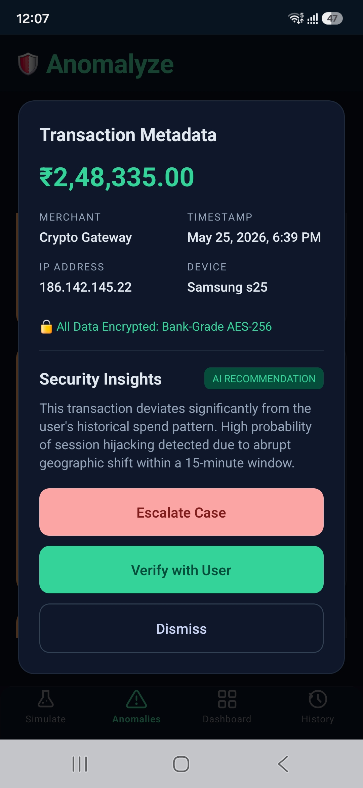

## Overview

A quick visual walkthrough of the application.

---

<table>
  <tr>
    <td align="center">
      <b>Simulate Transaction</b> 
      
    </td>
    <td align="center">
      <b>Anomalies Screen</b> 
      
    </td>
  </tr>

  <tr>
    <td align="center">
      <b>Investigate Alert</b> 
      
    </td>
    <td align="center">
      <b>Dashboard</b> 
      
    </td>
  </tr>

  <tr>
    <td align="center">
      <b>History</b> 
      
    </td>
    <td></td>
  </tr>
</table>

---
